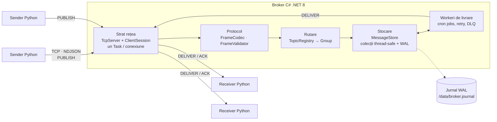
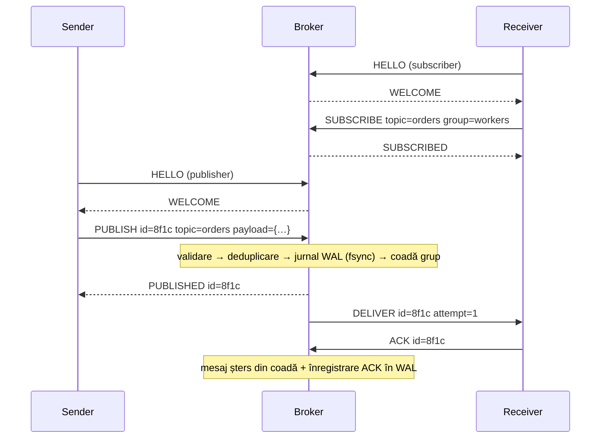
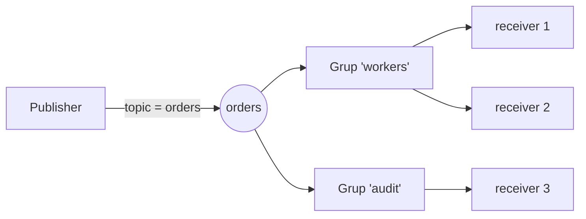
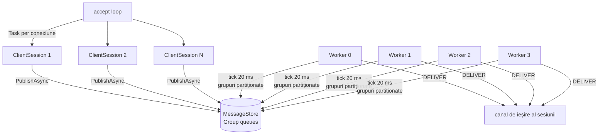
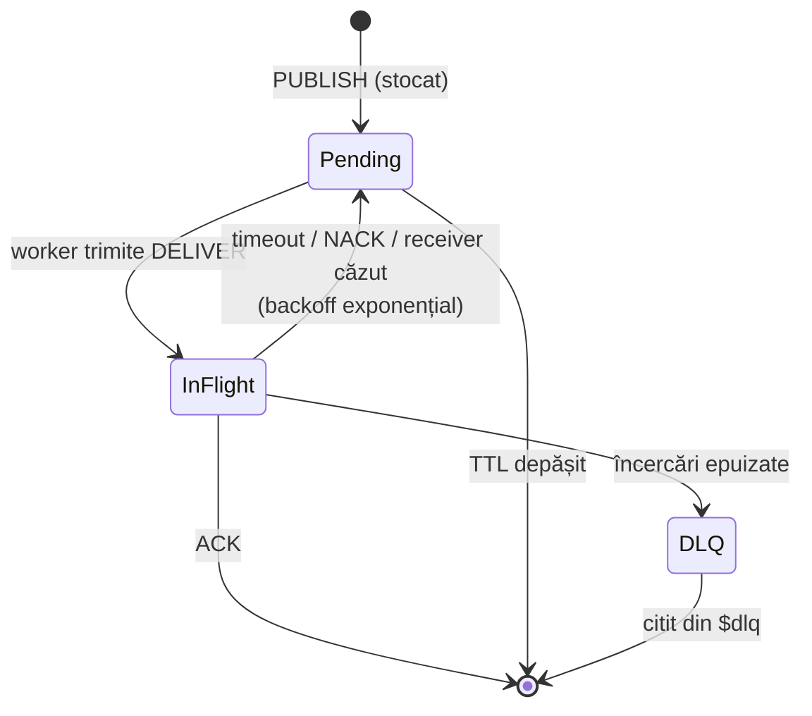
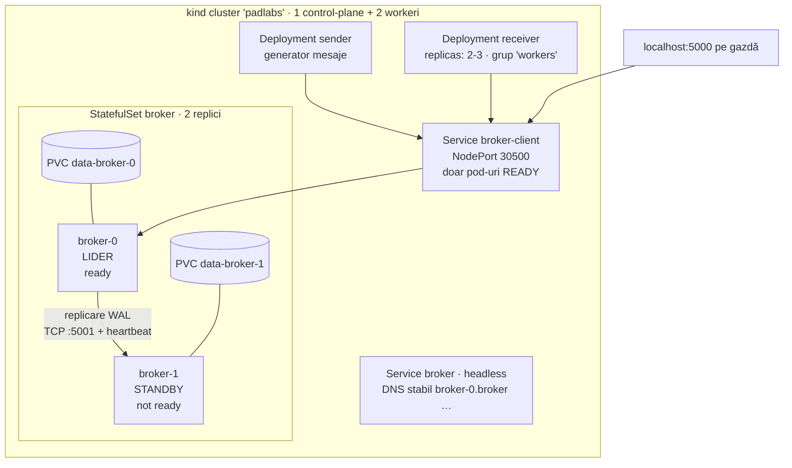

# Agent de mesagerie (Message Broker) — Documentație completă

**Proiectul Nr.1, Partea 1 — implementare cu Socket-uri (TCP)**
Broker: C# (.NET 8) · Sender/Receiver: Python 3 · Docker · Kubernetes (kind) · clustering primary/standby

> Document structurat pentru a fi transformat ulterior în prezentare PowerPoint: fiecare secțiune `##` ≈ 1–3 slide-uri,
> fiecare începe cu un rezumat **„Pe scurt”**, diagramele sunt Mermaid (pot fi randate la imagine și lipite în slide-uri),
> iar exemplele (JSON, loguri, rezultate) provin din rulări reale ale sistemului.

---

## 1. Scopul și obiectivele lucrării

**Pe scurt:** integrare asincronă între componente distribuite prin intermediul unui agent de mesaje, implementată la nivel de socket-uri.

* Scop: integrarea bazată pe agenți de mesaje, care permite comunicare **asincronă** între componentele unui sistem distribuit.
* Obiectiv (Partea 1): sistem complet realizat cu **Socket-uri**; (Partea 2, ulterior: același sistem cu **RPC** — gRPC/Thrift).
* Cerințe acoperite:
  1. protocol de lucru definit (format, canale, structura comunicației, politici de livrare);
  2. nivel abstract de comunicare (rețea), transport argumentat, **tratare concurentă**;
  3. păstrarea mesajelor: **transient** (colecții concurente) și **persistent** (serializare asincronă), rutare **Publisher/Subscriber** pe topic;
  4. în plus față de nota minimă: Docker, Kubernetes și clustering pentru eliminarea punctului unic de eșec.

---

## 2. Ce este un message broker

**Pe scurt:** o componentă fizică care primește mesaje de la emițători și le rutează către receptori, decuplându-i.

* Emițătorul comunică doar cu brokerul, indicând un nume logic (**topic**); nu cunoaște receptorii.
* Responsabilități: primirea mesajelor · determinarea destinatarilor și rutarea · tratarea diferențelor dintre interfețe · transmiterea.

| Beneficii | Constrângeri |
|---|---|
| Reduce cuplarea (grupare transparentă a receptorilor sub un nume logic) | Crește complexitatea (multithreading, protocoale) |
| Crește integrabilitatea (participanții nu au aceeași interfață) | Crește efortul de mentenanță (înregistrare/identificare participanți) |
| Crește evolutivitatea (brokerul izolează schimbările) | **Single point of failure** → rezolvat aici prin cluster primary/standby |
| | Overhead (un pas suplimentar în comunicare) |

---

## 3. Arhitectura sistemului

**Pe scurt:** sender → broker → receiver; brokerul are straturi clare: rețea, protocol, rutare, stocare, workeri de livrare.



Componentele din cod (`broker/src/Broker/`):

| Strat | Clase | Rol |
|---|---|---|
| Rețea | `TcpServer`, `ClientSession`, `HealthServer` | acceptă conexiuni, sesiune per client, health/metrics HTTP |
| Protocol | `Frame`, `FrameCodec`, `FrameValidator`, `LineReader`, `ErrorCodes` | serializare NDJSON, validare, citire de linii cu limită |
| Rutare | `TopicRegistry`, `Group`, `Delivery` | topic → grupuri de abonați, cozi per grup |
| Stocare | `MessageStore`, `IJournal` (`NullJournal`, `FileJournal`) | transient + persistent |
| Livrare | `DeliveryWorker`, `RetryPolicy` | work joburi: livrare, timeout ACK, backoff, DLQ |
| Cluster | `ClusterManager`, `ReplicatingJournal` | alegere lider, replicare WAL, failover |

Clienții (`clients/`): `common/client.py` (conectare, framing, reconectare cu backoff), `sender.py`, `receiver.py`.

---

## 4. Alegeri tehnologice și argumentare

**Pe scurt:** TCP pentru fiabilitate, JSON pe linii pentru simplitate și interoperabilitate, C# pentru broker, Python pentru clienți.

| Decizie | Alegere | Argumentare |
|---|---|---|
| Transport | **TCP** | livrare fiabilă și ordonată, fără pierderi sau alterări; UDP ar cere reimplementarea confirmărilor, retransmisiei și ordonării. Pentru un broker, pierderea unui mesaj în rețea este inacceptabilă. |
| Format | **JSON** | citibil, suport nativ în ambele limbaje; sender-ul serializează, brokerul parsează doar „plicul” (action/topic/id), payload-ul rămâne opac. (Alternativa binară — protobuf — este tema Părții 2.) |
| Delimitare cadre | **NDJSON** (un JSON pe linie) | JSON escapează `\n`, deci delimitarea e sigură; trivial de implementat pe orice limbaj; depanabil cu `nc`/telnet. Limită de dimensiune contra abuzurilor. |
| Canale | **variabile, câte unul per topic**, create la prima utilizare | numărul de canale depinde de tipurile de mesaje; nu e nevoie de configurare prealabilă. Fiecare conexiune e **unidirecțională** (rol publisher sau subscriber). |
| Structura comunicației | **Publisher/Subscriber pe topic**, cu grupuri | un publisher → N grupuri (fan-out); în grup, membrii își împart mesajele. „Unul-la-unu” = un singur abonat. |
| Limbaje | **C# (broker)** + **Python (clienți)** | brokerul e componenta critică: async/await, `Channel<T>`, colecții concurente, performanță. Clienții sunt simpli și rapid de scris în Python. Demonstrează că protocolul este independent de limbaj. |
| Garanție de livrare | **at-least-once** + deduplicare după `id` | simplu și robust la căderi; receiverii sunt idempotenți. |

---

## 5. Protocolul de lucru

**Pe scurt:** sesiune `HELLO` → cadre JSON pe linie; `PUBLISH`/`SUBSCRIBE`/`ACK`; erori explicite fără a închide conexiunea. Specificația completă: [`protocol.md`](protocol.md).



Exemplu de mesaj publicat (real):

```json
{"action":"PUBLISH","id":"fab668ae308f4b66a53e043286faec0a","topic":"orders","type":"OrderCreated",
 "timestamp":"2026-10-07T14:54:58+00:00","payload":{"orderId":42,"total":99.5}}
```

**Mesajul nu este alterat:** `payload` este păstrat ca text JSON brut și retransmis identic (verificat de testele `test_publish_deliver_ack` și `Valid_publish_keeps_payload_untouched`, inclusiv diacritice, numere cu zecimale, `null`, structuri imbricate).

---

## 6. Canale și rutare Publisher/Subscriber

**Pe scurt:** topicul este identificatorul logic al canalului; grupurile decid cine primește ce.



* Grup diferit → **fiecare primește o copie** (fan-out: `audit` primește tot).
* Același grup → **își împart mesajele** (round-robin: `receiver 1` / `receiver 2`).
* Implicit `group = clientId` ⇒ fiecare receiver primește toate mesajele.
* Topic fără abonați → mesajele așteaptă într-un **backlog** și sunt atribuite primului grup care se abonează.
* Subiecte rezervate: `$dlq` (mesaje „moarte”) — poate fi citit de oricine, nu poate fi publicat de clienți.
* Verificat de: `test_fanout_between_groups_and_competition_within_group`, `test_backlog_delivered_to_first_subscriber`.

---

## 7. Tratarea concurentă

**Pe scurt:** un Task asincron per conexiune (nu blochează I/O), workeri cron pentru livrare, colecții protejate pentru stocare.

* **Thread-per-request (variantă async):** `TcpServer` acceptă într-o buclă asincronă și pornește un `Task` pentru fiecare `ClientSession`; citirea și scrierea unei sesiuni sunt independente (coadă de ieșire `Channel<string>` cu un singur scriitor). Canalul de I/O nu este blocat de procesarea unei cereri.
* **Work joburi (cron jobs):** `Workers` (implicit 4) task-uri `DeliveryWorker`, fiecare cu `PeriodicTimer` (20 ms). Grupurile sunt **partiționate** pe workeri după hash-ul cheii → fără concurență pe același grup, deci fără blocări între workeri.
* **Colecții thread-safe:** `ConcurrentDictionary` (registru, deduplicare), `Group` cu lock propriu peste `LinkedList` + `Dictionary` (coadă ordonată cu ștergere O(1)), `Channel<T>` (ieșire sesiuni, jurnal), contoare cu `Interlocked`.
* **Backpressure:** coadă de ieșire limitată per client (un consumator prea lent este deconectat), `MaxGroupQueue` (publisherul primește `QUEUE_FULL`), fereastră de mesaje in-flight per grup.
* Verificat de: `test_concurrent_publishers_no_loss_no_duplicates` (8 publisheri × 100 mesaje simultan → toate 800 primite, fără pierderi).



---

## 8. Stocarea mesajelor: transient și persistent

**Pe scurt:** același strat de stocare, două moduri: doar în memorie sau cu jurnal WAL pe disc (`BROKER__STORAGE=memory|file`).

| | Transient (`memory`) | Persistent (`file`) |
|---|---|---|
| Unde | colecții concurente din memorie (`Group`) | colecții + jurnal `broker.journal` (JSONL, append-only) |
| Căderea brokerului | mesajele se pierd | mesajele neconfirmate se **recuperează la repornire** |
| Durabilitate | – | `PUBLISHED` se trimite **după fsync** |
| Scriere | – | asincronă: un singur task scriitor, **group commit** (un fsync pentru un lot de înregistrări) |

Detalii mod persistent:
* Înregistrări WAL: `grp` (grup creat), `pub` (mesaj pentru un grup), `ack` (mesaj încheiat: confirmat, expirat sau în DLQ).
* Ordinea: mai întâi înregistrarea durabilă, apoi mesajul devine vizibil workerilor ⇒ un `ack` nu poate precede `pub` în jurnal.
* **Recuperare + compactare la pornire:** se reface starea (pub − ack), jurnalul se rescrie atomic (fișier temporar + `Move`), liniile corupte (ex. ultima scrisă parțial la cădere) sunt ignorate.
* Verificat de: `test_unacked_messages_survive_broker_crash` (5 mesaje, `kill` brusc, repornire → toate 5 livrate; după ACK și altă repornire → nimic de livrat).

---

## 9. Politici de livrare și tratarea erorilor

**Pe scurt:** brokerul nu cade niciodată din cauza unui mesaj invalid; livrarea este at-least-once cu retry, backoff și Dead Letter Queue.

| Caz | Comportament | Cod / mecanism |
|---|---|---|
| JSON invalid / nu e obiect / tipuri greșite | `ERROR INVALID_JSON`, conexiunea rămâne deschisă | `FrameCodec.Decode` |
| câmp lipsă / invalid, acțiune necunoscută | `ERROR MISSING_FIELD` / `INVALID_FIELD` / `UNKNOWN_ACTION` | `FrameValidator` |
| cadru prea mare | `ERROR FRAME_TOO_LARGE`, se sare peste linie | `LineReader` |
| primul cadru nu e `HELLO` | `ERROR NOT_HELLO` + închidere | `ClientSession` |
| rol nepermis, topic rezervat | `FORBIDDEN_ROLE` / `FORBIDDEN_TOPIC` | `ClientSession`, `FrameValidator` |
| `PUBLISH` duplicat (același `id`) | confirmat cu `duplicate:true`, nu se dublează | deduplicare (fereastră 10 min) |
| receiver nu trimite `ACK` | retrimitere cu **backoff exponențial** (0,5 s · 2ⁿ, max 30 s) | `Group.Collect` |
| după `MaxAttempts` (5) | mutare în topicul `$dlq` cu motiv + payload original | `MessageStore.DeadLetterAsync` |
| receiver cade | mesajele lui in-flight revin imediat în coadă → alți membri ai grupului | `Group.RemoveMember` |
| `NACK` explicit | contează ca încercare, reprogramare cu backoff | `ClientSession.OnNackAsync` |
| TTL depășit (`ttlMs`) | mesajul se șterge, nu se livrează | `Group.Collect` |
| coadă plină | `ERROR QUEUE_FULL` către publisher | `MaxGroupQueue` |
| consumator prea lent | conexiune închisă, mesajele revin în coadă | coadă de ieșire limitată |
| scriere eșuată în jurnal | `ERROR INTERNAL`, mesajul NU e confirmat (publisherul retrimite) | `PublishAsync` |
| cădere broker (`file`) | recuperare din WAL | secțiunea 8 |
| cădere broker (cluster) | failover la standby | secțiunea 11 |
| oprire (Ctrl+C / SIGTERM) | oprire grațioasă: se închid sesiunile, se golește jurnalul | `Program.cs` |

Exemplu real — receiver care nu confirmă niciodată (`AckTimeoutMs=500`, `MaxAttempts=3`):

```text
# receiver
17:54:58 [orders] id=fab668ae… attempt=1 payload={"orderId": 42, "total": 99.5}
17:54:59 [orders] id=fab668ae… attempt=2 payload={"orderId": 42, "total": 99.5}
17:55:00 [orders] id=fab668ae… attempt=3 payload={"orderId": 42, "total": 99.5}
# broker
17:55:00 warn: Mesajul fab668ae… (orders/receiver-A) trimis în DLQ după 3 încercări
# cititor $dlq
17:55:00 [$dlq] payload={"originalId":"fab668ae…","topic":"orders","group":"receiver-A","attempts":3,
                         "reason":"numărul maxim de încercări depășit","payload":{"orderId":42,"total":99.5}}
```

Exemplu real — mesaje invalide (brokerul rămâne activ):

```text
răspuns broker: {'action': 'ERROR', 'code': 'INVALID_JSON', 'reason': "'n' is an invalid start of a property name…"}
17:54:59 warn: sender-e686ea#4: cadru respins [INVALID_JSON] 'n' is an invalid start of a property name…
```



---

## 10. Docker

**Pe scurt:** două imagini (broker, clienți) + `docker-compose.yml` pentru un demo local într-o comandă.

* `broker/Dockerfile` — build multi-stage (`dotnet/sdk:8.0` → `dotnet/runtime:8.0`), utilizator non-root, volum `/data` pentru jurnal, configurare prin variabile de mediu (`BROKER__STORAGE=file`, `BROKER__CLUSTER__…`), porturi 5000 (clienți), 5001 (replicare), 8080 (health).
* `clients/Dockerfile` — `python:3.12-slim`, aceeași imagine pentru sender și receiver (se alege scriptul prin `command`).
* `docker-compose.yml` — broker (mod `file`, volum persistent) + receiver + sender generator:

```powershell
docker compose up --build                 # pornește totul
docker compose up --scale receiver=3      # 3 receiveri în același grup
docker compose logs -f receiver
```

Endpoint-uri HTTP ale brokerului (port 8080): `/healthz` (liveness), `/ready` (readiness; `503` pe standby), `/role` (`leader`/`standby`), `/metrics` (JSON: conexiuni, publicate, livrate, retrimise, confirmate, DLQ, expirate, cadre invalide, duplicate).

---

## 11. Kubernetes și clustering

**Pe scurt:** cluster `kind` (3 noduri, rulat în Docker pe un singur PC); brokerul rulează ca StatefulSet cu 2 replici în configurație primary/standby, cu replicare WAL și failover automat.

### 11.1 Topologie



Manifeste (`deploy/`): `kind-cluster.yaml` (3 noduri, port-mapping 30500 → localhost:5000), `k8s/namespace.yaml`, `broker-configmap.yaml`, `broker-service.yaml` (headless + NodePort), `broker-statefulset.yaml` (probe, PVC), `receiver-deployment.yaml`, `sender-deployment.yaml`, `demo.ps1`.

Puncte cheie:
* **Readiness = „sunt liderul”**: `GET /ready` → `200` doar pe lider; Service-ul `broker-client` trimite trafic numai către pod-ul ready ⇒ clienții ajung mereu la lider, fără proxy suplimentar.
* **Headless Service cu `publishNotReadyAddresses: true`**: nodul standby (not ready) rămâne rezolvabil DNS pentru replicare.
* `podManagementPolicy: Parallel`: ambele noduri pornesc simultan (cu `OrderedReady`, standby-ul care nu devine niciodată „ready” ar bloca pornirea).
* **PVC per replică** (`volumeClaimTemplates`) → jurnalul supraviețuiește repornirii pod-ului.
* Clienții folosesc DNS `broker-client` și **se reconectează automat** (backoff exponențial cu jitter); publisherul retrimite cu același `id` (deduplicare).

### 11.2 Mecanismul de clustering (primary / standby)

* **Replicare:** fiecare înregistrare WAL scrisă de lider (`ReplicatingJournal`) este trimisă și standby-ului prin TCP (port 5001, același format NDJSON); la conectare standby-ul primește un **snapshot** al stării, apoi fluxul live. **Heartbeat** la 0,5 s.
* **Alegerea liderului** (fără etcd/Raft, deterministă):
  1. la pornire, un nod caută un lider existent; dacă îl găsește → devine **standby** și se resincronizează;
  2. dacă nu există lider: nodul cu **ordinalul cel mai mic** (`broker-0`) se promovează imediat, celelalte după `FailoverMs` (3 s);
  3. dacă liderul dispare (conexiune închisă sau fără heartbeat), standby-ul se promovează cu starea replicată;
  4. un lider verifică periodic dacă există un alt lider; **ordinalul mai mare cedează** (închide sesiunile, revine standby și se resincronizează).
* **Standby:** nu acceptă clienți (conexiunile sunt închise) și nu livrează mesaje.
* Testat automat: `ClusterTests` — două noduri, mesaje publicate la lider, `kill` lider → standby devine lider în câteva secunde și livrează toate cele 5 mesaje replicate; vechiul lider repornit devine standby (nu preemptează).

### 11.3 Limitări asumate (de menționat la prezentare)

| Limitare | Consecință | Posibilă îmbunătățire |
|---|---|---|
| Replicare **asincronă** | la failover, ultimele mesaje confirmate publisherului dar încă nereplicate pot lipsi | replicare sincronă (ACK de la standby înainte de `PUBLISHED`) |
| Fără cvorum (2 noduri, nu Raft) | la partiție de rețea pot exista temporar doi lideri; cel cu ordinal mai mare cedează la refacerea conectivității și își pierde modificările divergente | 3 noduri + consens Raft |
| Compactarea jurnalului doar la pornire | jurnalul crește cât timp brokerul rulează fără restart | compactare periodică în task-ul scriitor |
| At-least-once | posibile livrări duplicate după failover | receiveri idempotenți după `id` |

### 11.4 Demonstrație pe un singur aparat

Cerințe: Docker Desktop (WSL2), `kind`, `kubectl`.

```powershell
powershell -ExecutionPolicy Bypass -File deploy/k8s/demo.ps1            # up + scale + failover
# sau pe pași:
powershell -File deploy/k8s/demo.ps1 -Step up                            # build imagini, creează cluster, aplică manifeste
kubectl -n padlabs get pods -o wide                                      # broker-0 = 1/1 Ready (lider), broker-1 = 0/1 (standby)
kubectl -n padlabs scale deploy/receiver --replicas=3                    # mai mulți abonați în grup
kubectl -n padlabs logs -f -l app=receiver --prefix                      # fiecare primește o parte din mesaje
kubectl -n padlabs delete pod broker-0                                   # cădere lider
kubectl -n padlabs get pods -w                                           # broker-1 devine Ready (lider); fluxul continuă
powershell -File deploy/k8s/demo.ps1 -Step down                          # șterge clusterul
```

> **Stare de verificare:** logica de clustering este testată automat local (două procese broker). Fișierele Docker/Kubernetes sunt scrise, dar la momentul redactării **nu au fost rulate pe această mașină** (Docker Desktop cere instalare cu drepturi de administrator). Rezultatele rulării în `kind` se adaugă în secțiunea 12 după prima rulare.

---

## 12. Ghid de rulare

**Pe scurt:** broker local în 2 comenzi, apoi sender/receiver în terminale separate.

Cerințe: .NET 8 SDK, Python 3.10+ (doar biblioteca standard).

```powershell
# 1) Broker (transient, port 5000)
cd broker
dotnet run --project src/Broker
#    persistent:   $env:BROKER__STORAGE="file"; $env:BROKER__DATADIR="./data"
#    alt port:     dotnet run --project src/Broker -- --Broker:Port=5001

# 2) Receiveri (terminale separate)
cd clients
python receiver.py --topic orders                         # primește tot
python receiver.py --topic orders --group workers         # doi receiveri cu același grup își împart mesajele
python receiver.py --topic orders --no-ack-rate 0.3       # simulează căderi (retry/DLQ)
python receiver.py --topic '$dlq'                         # mesaje moarte

# 3) Sender
python sender.py --topic orders --payload '{"orderId": 1, "total": 25.5}' --type OrderCreated
python sender.py --topic orders --count 1000 --threads 8  # generator
python sender.py --topic orders --raw '{nu e json'        # test mesaj invalid → ERROR, brokerul rămâne activ
```

Configurare (variabile de mediu `BROKER__*` sau `appsettings.json`):

| Setare | Implicit | Rol |
|---|---|---|
| `Port` / `Host` | 5000 / 0.0.0.0 | adresa socket-ului |
| `Storage` / `DataDir` | memory / ./data | transient sau persistent |
| `Workers` / `WorkerIntervalMs` | 4 / 20 | work joburi de livrare |
| `AckTimeoutMs` / `MaxAttempts` | 5000 / 5 | politica de retry |
| `RetryBaseMs` / `RetryMaxMs` | 500 / 30000 | backoff exponențial |
| `InFlightWindow` | 1000 | mesaje neconfirmate simultan per grup |
| `MaxFrameBytes` | 1 MB | limită cadru |
| `MaxGroupQueue` | 100000 | backpressure |
| `DefaultTtlMs` | 0 (fără) | TTL implicit |
| `Cluster__Enabled`, `Cluster__NodeId`, `Cluster__Peers`, `Cluster__ReplPort`, `Cluster__FailoverMs` | – | clustering |

---

## 13. Testare și rezultate

**Pe scurt:** 21 teste unitare (xUnit) + 13 teste de integrare (pornesc brokerul real) — toate trec.

```powershell
cd broker;  dotnet test tests/Broker.Tests          # 21 teste unitare
cd clients; python -m unittest discover -s tests -v  # 13 teste de integrare (broker real + clienți Python)
```

| Scenariu | Test |
|---|---|
| publish → deliver → ACK; payload neschimbat (diacritice, zecimale, null, imbricat); fără retrimitere după ACK | `test_publish_deliver_ack` |
| 10 tipuri de cadre invalide → `ERROR` corect, brokerul și conexiunea rămân vii | `test_invalid_messages_do_not_crash_broker` |
| primul cadru ≠ HELLO | `test_first_frame_must_be_hello` |
| cadru > limită, apoi conexiunea funcționează | `test_frame_too_large` |
| backlog atribuit primului abonat | `test_backlog_delivered_to_first_subscriber` |
| fan-out între grupuri + împărțire în grup | `test_fanout_between_groups_and_competition_within_group` |
| deduplicare după `id` | `test_duplicate_publish_is_idempotent` |
| retry (încercările 1, 2, 3) apoi DLQ cu payload original | `test_retry_then_dead_letter` |
| cădere receiver → mesajele merg la alt membru | `test_receiver_crash_redelivers_to_other_member` |
| TTL | `test_ttl_expired_message_is_dropped` |
| 8 publisheri concurenți × 100 mesaje, fără pierderi/duplicate | `test_concurrent_publishers_no_loss_no_duplicates` |
| persistență: `kill` broker → recuperare; după ACK nimic de livrat | `test_unacked_messages_survive_broker_crash` |
| cluster: replicare, failover, reintegrare ca standby | `test_failover_preserves_messages_and_old_leader_rejoins_as_standby` |

**Măsurători** (aceeași mașină, 16 conexiuni sender simultane × 8000 mesaje, 1 receiver Python, ack pentru fiecare mesaj):

| Mod | Publicare (până la `PUBLISHED`) | Livrate / confirmate | Pierdute |
|---|---|---|---|
| `memory` | ≈ 6 400 msg/s | 8000 / 8000 | 0 |
| `file` (fsync cu group commit) | ≈ 6 000 msg/s | 8000 / 8000 | 0 |

Livrarea cap-coadă (≈ 1–2 mii msg/s) este limitată de receiverul Python single-thread, nu de broker. Mod `file` costă puțin datorită *group commit*-ului (un singur fsync pentru un lot de înregistrări).

---

## 14. Limitări și legătura cu Partea 2 (RPC)

* Limitările clusterului — vezi 11.3. Garanția este *at-least-once* (nu *exactly-once*).
* Ordinea mesajelor este păstrată pentru prima livrare dintr-un grup, dar retrimiterile pot schimba ordinea.
* Autentificare/criptare TLS: nu sunt implementate (clientul se identifică doar prin `clientId`).

**Partea 2:** arhitectura rămâne identică; se înlocuiește nivelul de rețea (`Network/`, `Protocol/`) cu un RPC (gRPC/protobuf sau Thrift), păstrând straturile de rutare, stocare, workeri și cluster. Datele trec din JSON în `.proto` (tipizare, validare la nivel de schemă), iar `LineReader`/`FrameCodec` dispar în favoarea codului generat. Validarea datelor și procesarea concurentă rămân cerințe.

---

## 15. Concluzii și referințe

* Sistem complet Sender → Broker → Receiver peste TCP, cu protocol propriu, Pub/Sub pe topic și grupuri, stocare transient și persistent, politici de livrare (retry, backoff, DLQ, TTL, deduplicare) și tratarea erorilor fără căderea brokerului.
* Concurență: Task per conexiune, workeri cron partiționați, colecții thread-safe, backpressure.
* Operabilitate: Docker, Kubernetes (kind), health/readiness/metrics, cluster primary/standby cu failover automat.
* Interoperabilitate dovedită: broker C# ↔ clienți Python.

Referințe (din enunț):
1. About Message Brokers — https://www.ibm.com/cloud/learn/message-brokers
2. Client/server pe socket-uri în Java — https://www.baeldung.com/a-guide-to-java-sockets
3. Colecții thread-safe în C# — https://www.tutorialspoint.com/Thread-Safe-Concurrent-Collection-in-Chash
4. JSON vs protobuf — https://auth0.com/blog/beating-json-performance-with-protobuf/
5. gRPC — https://grpc.io/docs/what-is-grpc/introduction/ · Apache Thrift — https://thrift.apache.org/
